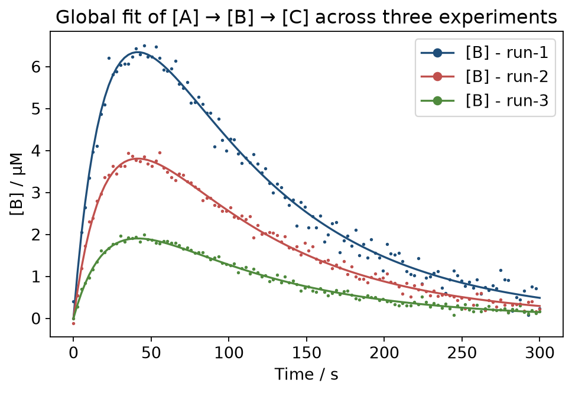
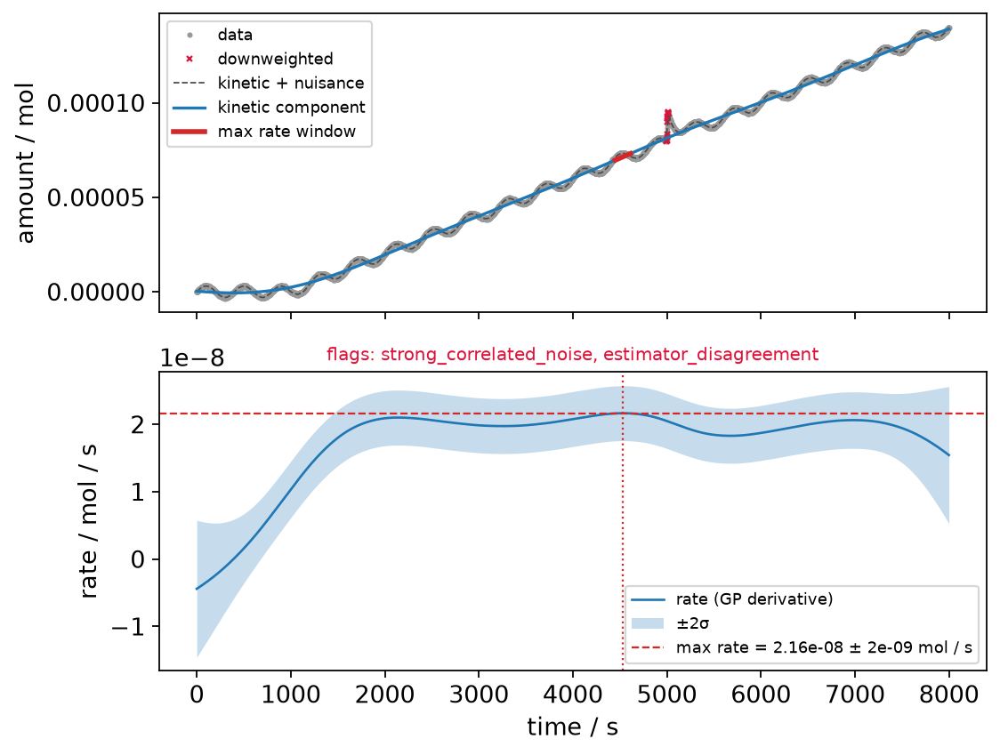

<div align="center">

# pyKES

**Kinetic Evaluation and Simulation for chemical reaction networks**

[](https://pykes.readthedocs.io/en/latest/)
[](https://pypi.org/project/pyKES/)
[](https://pypi.org/project/pyKES/)
[](LICENSE)
[](https://numpydoc.readthedocs.io/en/latest/format.html)

[Documentation](https://pykes.readthedocs.io) ·
[Quickstart](https://pykes.readthedocs.io/en/latest/quickstart.html) ·
[User guide](https://pykes.readthedocs.io/en/latest/guide/architecture.html) ·
[API reference](https://pykes.readthedocs.io/en/latest/api/index.html) ·
[Changelog](CHANGELOG.md)

</div>

---

pyKES is a Python package for the kinetic modelling of chemical reaction
networks, built around the needs of photocatalysis research: light-driven
reaction networks, noisy sensor traces of evolved gas, and datasets of hundreds
of experiments that all have to be processed the same way.

It covers the whole path from a raw instrument file to a mechanistic conclusion.

```bash
pip install pyKES
```

---

## Simulate a reaction network

Write the mechanism the way you would on a whiteboard. Species go in square
brackets, the rate constant follows a comma, and anything after a semicolon is
an extra multiplier — which is how light enters.

```python
import numpy as np
from pyKES.reaction_model import Reaction_Model

model = Reaction_Model(
    reaction_network=['[RuII] > [RuII-ex], k1 ; hv_functionA',
                      '[RuII-ex] > [RuII], k8',
                      '[RuII-ex] + [S2O8] > [RuIII] + [SO4], k7',
                      '[RuIII] > [H2O2] + [RuII], k2 ; hv_functionB',
                      '2 [RuIII] > [Ru-Dimer], k3',
                      '[H2O2] > [O2], k5',
                      '[RuIII] > [Inactive], k6'],
    rate_constants=RATE_CONSTANTS,
    initial_conditions={'[RuII]': 10, '[S2O8]': 6000},
    other_multipliers=OTHER_MULTIPLIERS,
    times=np.linspace(0, 300, 1000))

model.solve_ode()
model.plot_solution(exclude_species=['[S2O8]', '[SO4]'])
```

<div align="center">

</div>

Both light-driven steps carry a **competitive-absorption multiplier**, resolved
against the current concentrations at every integration step — so the strongly
absorbing Ru(II) and the weakly absorbing Ru(III) compete for the incident
photons as their ratio shifts. O₂ evolution tails off long before the persulfate
is exhausted, because the photosensitizer is being consumed by the loss
channels.

---

## Fit rate constants across a whole dataset

A single curve rarely constrains a mechanism. pyKES fits **one parameter set to
many experiments at once**, reading each experiment's own concentrations, light
intensity and time grid out of the experiment itself.

```python
from pyKES.fitting_ODE import Fitting_Model, square_loss_time_series

model = Fitting_Model(['[A] > [B], k1',
                       '[B] > [C], k2'])

model.experiments = list(dataset.experiments.values())
model.rate_constants_to_optimize = {'k1': (1e-3, 5e-1),
                                    'k2': (1e-3, 5e-1)}

# A path, not a number — resolved per experiment.
model.initial_conditions = {'[A]': 'metadata/initial_concentration_uM'}
model.data_to_be_fitted = {'[B]': {'x': 'processed_data/intermediate/x',
                                   'y': 'processed_data/intermediate/y'}}
model.times = {'times': 'processed_data/times'}
model.loss_function = square_loss_time_series

model.optimize()
model.visualize_optimization_results()
```

<div align="center">

</div>

Three starting concentrations, one mechanism, one pair of rate constants —
recovered to better than 0.5 % of the values the data was generated from.

---

## Extract maximum rates from noisy traces

Real sensor data carries bubbles, thermal drift and stirring beats. Differencing
neighbouring points reports the largest disturbance, not the largest rate.

```python
from pyKES.utilities.max_rate import extract_max_rate, plot_max_rate
from pyKES.utilities.unit_handler import Quantity

result = extract_max_rate(Quantity(time_seconds, 's'),
                          Quantity(evolved_h2_umol, 'umol'))

print(result.max_rate.unit['umol / h'])   # read it in whatever unit you want
print(result.max_rate_std)                # its standard deviation
print(result.flags)                       # empty list = nothing suspicious
```

<div align="center">

</div>

The trace above carries a baseline wave whose local slope rivals the true rate
and a bubble whose instantaneous slope is **75×** it. Separating them by
*structure* rather than amplitude — a Matérn-5/2 kinetic component, a
short-correlation nuisance component and two-sided excursion rejection, fitted
by exact O(n) Kalman smoothing — recovers the rate to within 8 % and flags the
disturbances it found. [Full write-up →](docs/max_rate.md)

---

## Trace where the light goes

Concentration traces do not say which fraction of the absorbed light reached the
product. Freezing the network at one point in time does.

```python
model.calculate_reaction_network_propopagation(
    timepoint=10,
    absorbing_species_with_extinction_coefficients={
        '[A]': {'excited_name': '[A-excited]', 'extinction_coefficient': 8500},
        '[B]': {'excited_name': '[B-excited]', 'extinction_coefficient': 5400}},
    photon_flux=1e17,
    pathlength=2.25,
    concentration_unit='uM')

model.plot_reaction_network_propagation()
```

<div align="center">

</div>

Of every 100 incident photons, 66 pass straight through, 33 are absorbed by [A],
and 25 of those decay unproductively — so roughly **8 photons in 100 do useful
work**. That number is the one worth optimizing, and it appears nowhere in the
kinetic traces. Bar heights are log-scaled so a pathway carrying a thousandth of
the light stays visible next to one carrying a third.

---

## What else is in the box

| | |
|---|---|
| **HDF5 datasets** | `ExperimentalDataset` keeps raw data, metadata and results in one file, with provenance stamps and parallel ingestion. Because the raw data stays in the file, an improved algorithm can be applied to a finished dataset years later — without the original instrument files. |
| **Streamlit pages** | Five reusable pages an external repository *configures rather than forks*: dataset loading, upload and processing, analysis results, time series and a results table. Deployable to a server or, via stlite, straight into the browser as a static site. |
| **Units** | A lightweight `Quantity` type so a rate in `mol/h` can be read as `umol/s` without a hand-written conversion factor — and so reading an O₂ rate as if it were H₂ raises instead of silently succeeding. |
| **Efficiencies** | Apparent quantum yield and light-to-hydrogen efficiency, computed in explicit units from measured rates. |

---

## Documentation

Full documentation lives at **[pykes.readthedocs.io](https://pykes.readthedocs.io)**.

| Section | |
|---|---|
| [Installation](https://pykes.readthedocs.io/en/latest/installation.html) | Getting set up, extras, editable installs alongside an embedding repo |
| [Quickstart](https://pykes.readthedocs.io/en/latest/quickstart.html) | Four self-contained examples, one per part of the package |
| [Architecture](https://pykes.readthedocs.io/en/latest/guide/architecture.html) | How the pieces fit together, with code-flow diagrams |
| [Reaction networks](https://pykes.readthedocs.io/en/latest/guide/reaction_networks.html) | Mechanism syntax, rate law, multipliers, stiffness |
| [Light absorption](https://pykes.readthedocs.io/en/latest/guide/light_absorption.html) | Competitive absorption, and wiring it into a mechanism |
| [Fitting](https://pykes.readthedocs.io/en/latest/guide/fitting.html) | Loss functions, weighting, bounds, diagnosing a bad fit |
| [Pathways](https://pykes.readthedocs.io/en/latest/guide/pathways.html) | Photon budgets, cycles, reconvergence, reading the diagram |
| [Maximum rates](https://pykes.readthedocs.io/en/latest/max_rate.html) | The algorithm stage by stage, with parameter guidance |
| [Datasets](https://pykes.readthedocs.io/en/latest/guide/dataset.html) | Ingestion, storage, reprocessing, provenance |
| [Streamlit app](https://pykes.readthedocs.io/en/latest/guide/streamlit_app.html) | Embedding and configuring the pages |
| [API reference](https://pykes.readthedocs.io/en/latest/api/index.html) | Generated from the docstrings |

---

## Development

```bash
git clone https://github.com/jschneidewind/pyKES.git
cd pyKES
pip install -e '.[dev]'
pytest
```

Build the documentation locally:

```bash
sphinx-build -b html docs docs/_build/html
```

Regenerate the figures above (they are produced by the package itself, so a
change in behaviour shows up here):

```bash
python docs/generate_example_figures.py
```

### Using pyKES from another repository

Depend on a released version:

```toml
dependencies = ["pyKES>=0.2.4"]
```

or, while developing both side by side:

```bash
pip install -e /path/to/pyKES
```

After a pyKES version bump, refresh the embedding repository's lock file with
`uv lock --refresh && uv sync`.

---

## Contributing

Contributions are welcome — please open an issue or a pull request. See the
[contributing guide](https://pykes.readthedocs.io/en/latest/contributing.html)
for the coding conventions this repository follows.

## License

MIT. See [LICENSE](LICENSE).

pyKES is developed in the
[Water Splitting Group](https://github.com/water-splitting-group) and shares its
outlook with [pyH2A](https://github.com/water-splitting-group/pyH2A), which
covers the techno-economic side of the same research.
