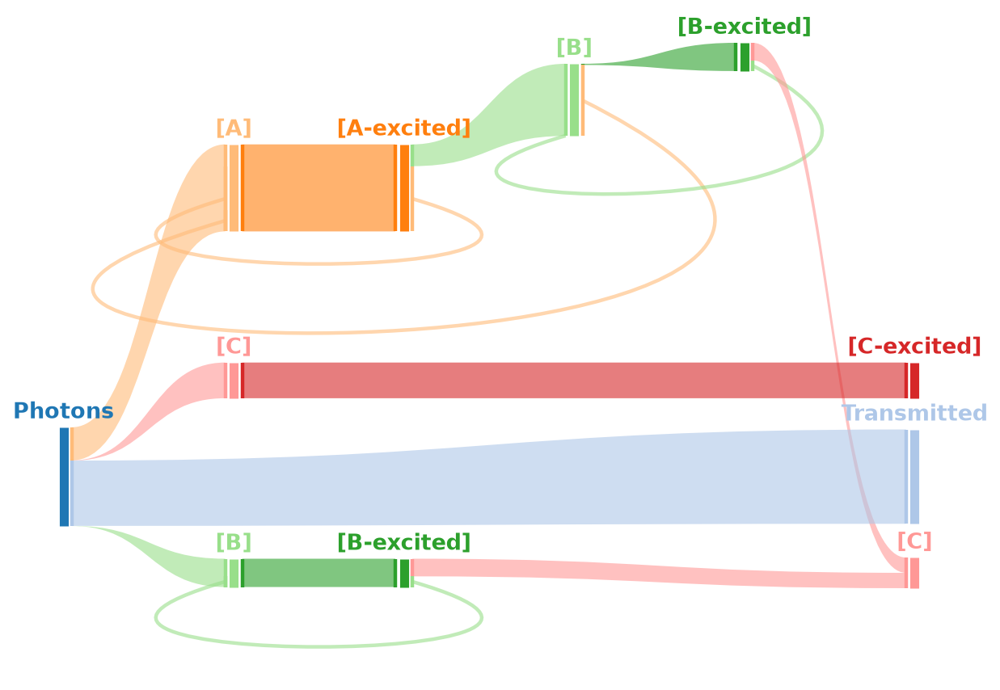

Pathway propagation: where does the light go?
=============================================

A solved network tells you how concentrations change. It does not tell you
which fraction of the absorbed light reached the product, and which fraction
was wasted — and for a photocatalytic system, that is usually the question the
experiment was designed to answer.

:mod:`pyKES.pathways.pathways` answers it by freezing the network at one point
in time and following the absorbed photons through it.

The idea in three steps
-----------------------

**1. At fixed concentrations, branching ratios are known.** If species X can
react by three routes, the rates of those three reactions are computable, and
their ratio is the probability that a molecule of X takes each one:

.. math::

   p_j = \frac{r_j}{\sum_{j'} r_{j'}}
   \qquad \text{over all reactions } j \text{ that consume X}

The concentration of X itself appears in every one of those rates and cancels
in the ratio, so the branching depends only on what X is competing against.

**2. Splitting an amount along those routes gives amounts of products** — which
can be split in turn. Recursion carries an initial amount all the way down the
network.

**3. Starting the recursion from light absorption gives the photon budget.**
The absorption calculation of :doc:`light_absorption` says what fraction of the
incident light each chromophore caught; propagating those fractions says where
they ended up.

.. mermaid::

   flowchart TD
       PH["1 photon"]
       ABS["calculate_excitations_per_second _multi_competing"]
       T["transmitted 0.66"]
       A["absorbed by [A] 0.33"]
       B["absorbed by [B] 0.001"]

       AX["[A-excited]"]
       BACK["→ [A] 0.251 <i>wasted</i>"]
       FWD["→ [B] 0.084"]

       PH --> ABS
       ABS --> T
       ABS --> A
       ABS --> B
       A --> AX
       AX -->|"75 %"| BACK
       AX -->|"25 %"| FWD
       FWD --> DOTS["… and onwards"]

       style T fill:#eeeeee,stroke:#999
       style BACK fill:#ffe0e0,stroke:#c66
       style FWD fill:#e1f5e1,stroke:#5a9

Reading a real budget off the diagram: of every 100 incident photons, 66 pass
straight through, 33 are absorbed by [A], and of those 33 about 25 decay
unproductively — so roughly 8 photons in 100 do useful work. That number is the
one worth optimizing, and it is not visible anywhere in the concentration
traces.

Two structural cases
--------------------

**Cycles.** Real networks have back-reactions, and a naive recursion would
follow them forever. Each branch carries the set of species already visited on
the way down and stops when it meets one of them again — so ``[A] → [A*] →
[B] → [A]`` terminates at the second [A], and the amount that returned there is
recorded as the endpoint of that branch.

**Reconvergent pathways.** A species reachable by more than one route is
reached at different points of a depth-first walk. Its subtree must be *summed*
rather than overwritten, and because the walk is depth-first, later arrivals
have to update amounts that were already computed downstream.
:func:`~pyKES.pathways.pathways.merge_propagation_trees` does that recursively.
:func:`~pyKES.pathways.pathways.test_propagate_species_function` is the check
that it does, on a network built to exercise exactly this case.

Running the analysis
--------------------

Through :class:`~pyKES.reaction_model.Reaction_Model`, on a network that has
already been solved:

.. code-block:: python

   model.calculate_reaction_network_propopagation(
       timepoint=10,
       absorbing_species_with_extinction_coefficients={
           '[A]': {'excited_name': '[A-excited]',
                   'extinction_coefficient': 8500},
           '[B]': {'excited_name': '[B-excited]',
                   'extinction_coefficient': 5400},
           '[C]': {'excited_name': '[C-excited]',
                   'extinction_coefficient': 1000}},
       photon_flux=1e17,
       pathlength=2.25,
       concentration_unit='uM')

   model.propagation_results
   # {'Light absorption': {'[A]': {'absorbed': 0.334,
   #                               '[A-excited]': {'amount_formed': 0.334,
   #                                               '[A]': {'amount_formed': 0.251},
   #                                               '[B]': {...}}},
   #                       '[B]': {...},
   #                       'transmitted': 0.661}}

or functionally, without a model object:

.. code-block:: python

   from pyKES.pathways.pathways import calculate_reaction_network_propagation

   results = calculate_reaction_network_propagation(
       concentrations=concentrations_at_timepoint,
       parsed_reactions=parsed_reactions,
       rate_constants=rate_constants,
       absorbing_species={'[A]': '[A-excited]', '[B]': '[B-excited]'},
       extinction_coefficients={'[A]': 8500, '[B]': 5400},
       photon_flux=1e17,
       pathlength=2.25,
       concentration_unit='uM')

.. important::

   **The result is a snapshot, not an average over the run.** The branching
   ratios are those of the concentrations at the chosen time, and they change
   as the reaction proceeds — early in a run the sensitizer is intact and the
   productive channel dominates; late in the run a decomposition product may be
   absorbing most of the light. Compute the budget at several time points
   before drawing a conclusion about "the" efficiency of the system.

Drawing it
----------

.. code-block:: python

   model.plot_reaction_network_propagation(
       value_key='log_value',
       fanning_factor=0.7,
       assumed_branching_degree=1.7,
       forward_link_kwargs={'alpha': 0.6})

How to read it:

* **Vertical bars are species**, one column per step away from the photon.
  Their height is the amount of light flowing through them.
* **Bands are reactions.** A band leaving a bar over half its height carries
  half of that species.
* **Looping bands** run backwards to an earlier column — those are the cycles,
  most often unproductive decay returning to the ground state.
* **The final column** holds the terminal species, each consolidated across
  every route that reached it. A product formed by three pathways appears once,
  with three incoming bands.

The layout parameters:

.. list-table::
   :header-rows: 1
   :widths: 32 68

   * - Parameter
     - Effect
   * - ``value_key``
     - ``'log_value'`` (default) or ``'value'``. See below.
   * - ``fanning_factor``
     - How much vertical room a node gives its children. Raise it when branches
       overlap, lower it when the figure is mostly whitespace.
   * - ``assumed_branching_degree``
     - How much wider the upper levels are made, to leave room for the levels
       below. Raise it for deep networks.
   * - ``excluded_nodes``, ``excluded_links``
     - Drop specific nodes or ``(source, target)`` pairs from the figure, for
       branches too small to be worth drawing.

.. note::

   **Why the bars are logarithmic by default.** A photon budget spans orders of
   magnitude: a main pathway carries a third of the light, a minor loss channel
   a thousandth. On a linear scale the minor channel is invisible — and the
   minor channels are usually the interesting ones, because they are what
   limits the yield. ``value_key='log_value'`` normalizes
   :math:`\log_{10}` of each amount against the smallest amount in the tree, so
   everything stays visible.

   The consequence is that **bar heights are not proportional to amounts**. For
   a figure where visual size means quantity, use ``value_key='value'`` and
   accept that small channels vanish. The underlying numbers are the same
   either way; ``results['nodes'][node_id]['value']`` always holds the true
   amount.

The transformation pipeline
---------------------------

:func:`~pyKES.pathways.transform_pathways_data.transform_data_for_plotting`
turns the nested tree into positioned nodes and links. Its stages are exposed
individually, which is useful when a layout needs adjusting:

.. mermaid::

   flowchart TD
       T0["nested tree <i>from calculate_reaction_network_propagation</i>"]
       T1["transform_pathways_data <i>flatten to nodes + links</i>"]
       T2["add_sibling_order <i>rank children by size</i>"]
       T3["post_process_pathways_data <i>redirect cycles, consolidate terminals</i>"]
       T4["add_y_coordinates <i>place nodes vertically</i>"]
       T5["add_link_starting_values add_link_ending_values"]
       T6["process_links <i>band coordinates</i>"]
       T7["plot_pathway_bars"]

       T0 --> T1 --> T2 --> T3 --> T4 --> T5 --> T6 --> T7

Node ids carry both the species name and the depth (``'[B]~2/0'``), so the same
species on two different branches stays two nodes — they are two different
pathways and are drawn separately. Only the *terminal* nodes are consolidated,
in step 3.

Reading the numbers directly
----------------------------

The tree is a plain nested dictionary, so a budget can be summarized without
plotting anything:

.. code-block:: python

   absorption = model.propagation_results['Light absorption']

   print(f"transmitted:        {absorption['transmitted']:.1%}")

   for ground_state, branch in absorption.items():
       if ground_state == 'transmitted':
           continue
       print(f"absorbed by {ground_state}: {branch['absorbed']:.1%}")

   # Unproductive decay of [A]: excited [A] that came straight back to [A]
   excited = absorption['[A]']['[A-excited]']
   wasted = excited.get('[A]', {}).get('amount_formed', 0.0)
   print(f"decayed back to [A]: {wasted / excited['amount_formed']:.1%} "
         f"of what [A] absorbed")

Reference
---------

* :mod:`pyKES.pathways.pathways` — proportions, propagation, merging.
* :mod:`pyKES.pathways.transform_pathways_data` — the layout pipeline.
* :mod:`pyKES.plotting.plotting_pathways_transformed` — the drawing.
* :doc:`light_absorption` — the absorption step the propagation starts from.
