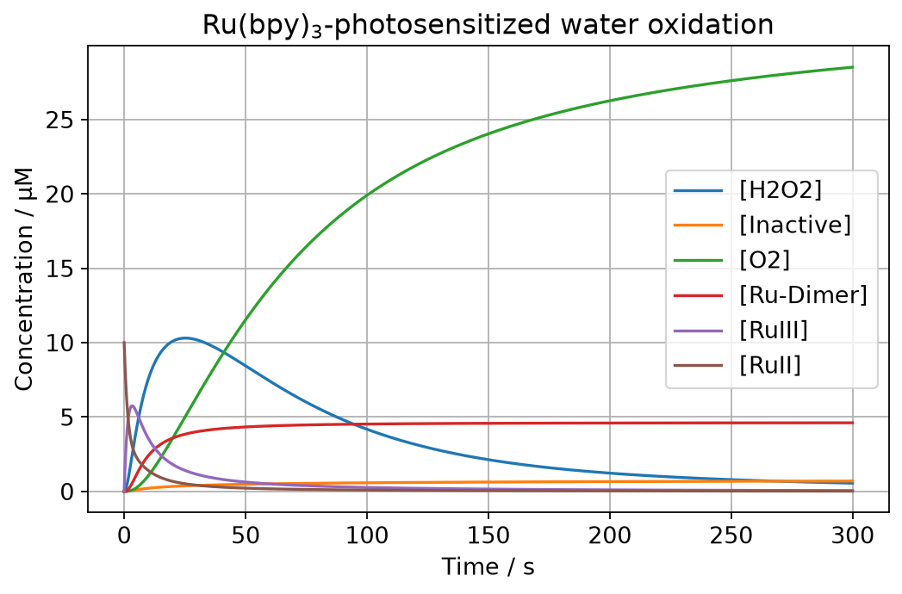

pyKES — Kinetic Evaluation and Simulation
=========================================

**pyKES** is a Python package for the kinetic modelling of chemical reaction
networks, built around the needs of photocatalysis research: light-driven
reaction networks, noisy sensor traces of evolved gas, and datasets of hundreds
of experiments that all have to be processed the same way.

It covers the whole path from a raw instrument file to a mechanistic
conclusion.

.. grid:: 2
   :gutter: 3

   .. grid-item-card:: ⚗️  Simulate a reaction network
      :link: guide/reaction_networks
      :link-type: doc

      Write a mechanism as a list of strings, get the coupled ODE system and
      its solution — with light absorption resolved at every integration step.

   .. grid-item-card:: 📉  Fit rate constants to data
      :link: guide/fitting
      :link-type: doc

      Fit one mechanism to a whole dataset at once, with per-experiment
      concentrations and light intensities read out of the experiments
      themselves.

   .. grid-item-card:: 🔦  Trace the photon budget
      :link: guide/pathways
      :link-type: doc

      Find out where the absorbed light actually goes, and draw it as a
      pathway diagram.

   .. grid-item-card:: 📈  Extract maximum rates
      :link: max_rate
      :link-type: doc

      Get a defensible maximum rate out of a noisy trace with bubbles, drift
      and baseline waves — with uncertainties and quality flags.

   .. grid-item-card:: 🗄️  Manage experimental datasets
      :link: guide/dataset
      :link-type: doc

      An HDF5-backed dataset that keeps raw data, metadata and results
      together, with provenance and reprocessing built in.

   .. grid-item-card:: 🖥️  Build a Streamlit app
      :link: guide/streamlit_app
      :link-type: doc

      Reusable pages an external repository configures rather than forks —
      deployable to a server or straight into the browser.

At a glance
-----------

.. code-block:: python

   import numpy as np
   from pyKES.reaction_model import Reaction_Model

   model = Reaction_Model(
       reaction_network=['[RuII] > [RuII-ex], k1 ; hv',
                         '[RuII-ex] > [RuII], k2',
                         '[RuII-ex] + [S2O8] > [RuIII] + [SO4], k3',
                         '[RuIII] > [H2O2] + [RuII], k4',
                         '[H2O2] > [O2], k5'],
       rate_constants={'k1': 1.0, 'k2': 1 / 650e-9, 'k3': 59.2,
                       'k4': 0.99, 'k5': 0.027},
       initial_conditions={'[RuII]': 10, '[S2O8]': 6000},
       other_multipliers={'hv': 0.34},
       times=np.linspace(0, 300, 1000))

   model.solve_ode()
   model.plot_solution(exclude_species=['[S2O8]', '[SO4]'])

Where to start
--------------

* Never used pyKES before → :doc:`installation` and then :doc:`quickstart`.
* Want to understand how the pieces fit together → :doc:`guide/architecture`.
* Looking for a specific function → :doc:`api/index`.

.. toctree::
   :maxdepth: 2
   :caption: Getting started
   :hidden:

   installation
   quickstart

.. toctree::
   :maxdepth: 2
   :caption: User guide
   :hidden:

   guide/architecture
   guide/reaction_networks
   guide/light_absorption
   guide/fitting
   guide/pathways
   max_rate
   guide/dataset
   versioning_and_reprocessing
   guide/units

.. toctree::
   :maxdepth: 2
   :caption: Streamlit application
   :hidden:

   guide/streamlit_app
   plotting_instructions
   browser_deployment

.. toctree::
   :maxdepth: 2
   :caption: API reference
   :hidden:

   api/index

.. toctree::
   :maxdepth: 1
   :caption: Project
   :hidden:

   contributing
   releasing
   changelog

Citing and license
------------------

pyKES is released under the :source:`MIT License <LICENSE>`. It is developed in
the `Water Splitting Group <https://github.com/water-splitting-group>`_ and
shares its outlook with `pyH2A <https://github.com/water-splitting-group/pyH2A>`_,
which covers the techno-economic side of the same research.

Indices
-------

* :ref:`genindex`
* :ref:`modindex`
* :ref:`search`
